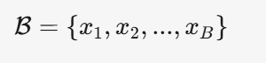
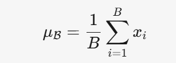
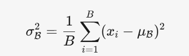
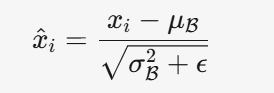
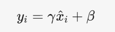

# 批量归一化（Batch Normalization）
## 一、为什么需要 Batch Normalization？
### 1. 训练神经网络时的问题：
#### • 在深层神经网络中，每一层的输入分布可能会随着前一层参数的变化而不断改变 → 称为 Internal Covariate Shift（内部协变量偏移）
#### • 这会导致：
  • 每层要不断适应新的分布
  • 学习速度变慢
  • 需要小心设置学习率
  • 容易出现梯度消失或爆炸
#### 目的：让每一层的输入分布保持稳定

### 二、Batch Normalization 做了什么？
#### 核心思想：
对每一层的输入（通常是激活值）进行标准化处理，使得它们的 均值为 0，方差为 1

#### 三、步骤
假设我们有一个 batch，包含 B 个样本，某个层的输出（比如激活值）为：

这些 x_i 可能是某个神经元的输出，形状可以是向量，但我们对每个维度单独做 BN。
##### 步骤 1：计算该 batch 的均值

##### 步骤 2：计算该 batch 的方差

##### 步骤 3：标准化（Normalization）
将每个 x_i 标准化为：

• 其中 \epsilon 是一个非常小的数（如 1e-5），为了防止分母为零
 这一步之后，\hat{x}_i 的均值为 0，方差为 1

##### 步骤 4：引入可学习的参数 —— Scale（γ） 和 Shift（β）
我们不想让网络失去表达能力，所以 不强制分布一定是标准正态，而是让它可以调整：

• \gamma：scale 参数（可学习，类似方差）

• \beta：shift 参数（可学习，类似均值）

所以，虽然我们做了标准化，但最终输出可以通过 γ 和 β 调整回任何分布，保持模型的表达能力。

### 四、Batch Normalization 的作用总结 
1. 加速训练：因为每层输入更稳定，学习效率高
2. 允许使用更大的学习率
3. 减少对初始化的依赖
4. 有轻微的正则化效果（Regularization）
   • 因为在训练时，BN 用的是 mini-batch 的统计量，带了一点噪声，类似 Dropout
5. 缓解梯度消失与梯度爆炸问题

### 五、Batch Normalization 是怎么用的？

• 通常用在 全连接层（Fully Connected Layer）之后、激活函数之前 或 之后
• 也用在 卷积层（Convolutional Layer）之后

### 六、测试时（Inference）怎么做
训练时我们是对 每个 mini-batch 算 μ 和 σ
但测试时，我们只有一个样本，无法算 batch 的统计量！
解决方案：
• 在训练过程中，对每一个 batch 计算 μ 和 σ，并记录其 moving average（滑动平均）
• 测试时，直接使用这些 全局统计量（running mean 和 running var） 来做标准化
BN 在训练和测试时的行为是不一样的

